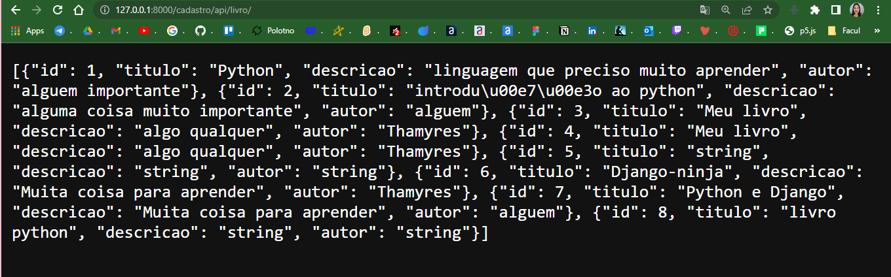
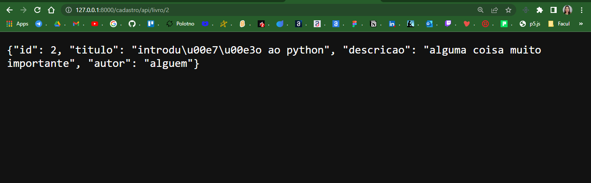
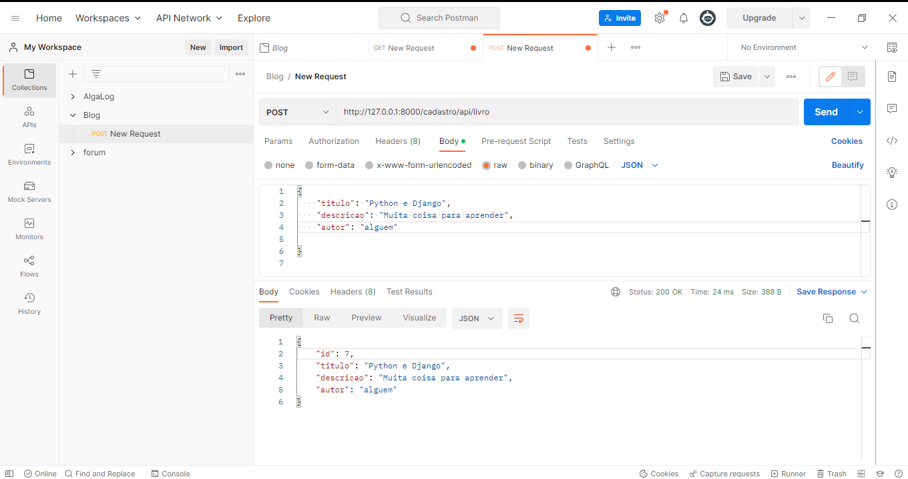
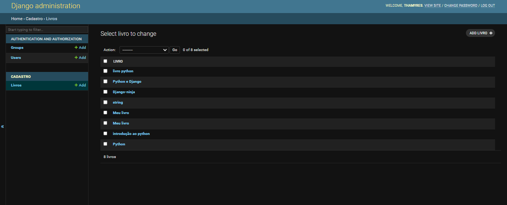
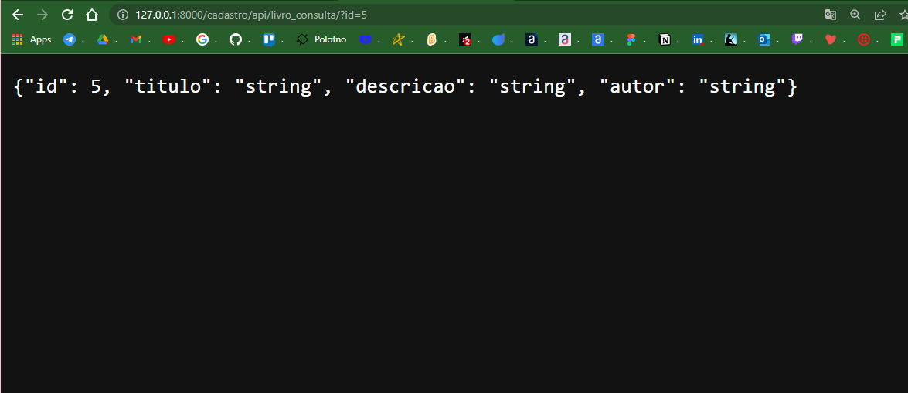
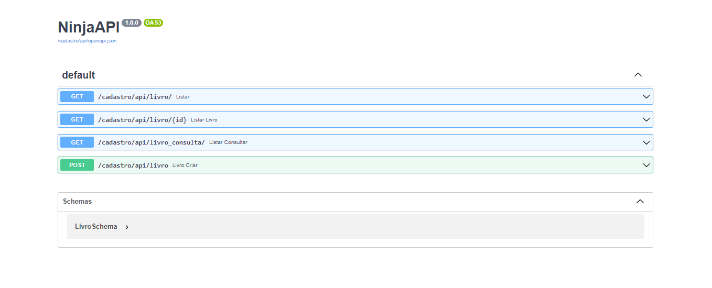
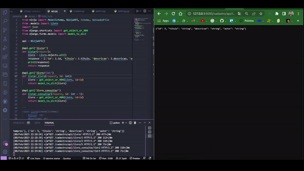

<h1 align="center"> DJANGO-NINJA | CRIANDO REST API'S </h1>

Projeto desenvolvido em Pyhton e Djando-Ninja junto com o Caio da Pythonando.

 

  <a href="#-tecnologias">Tecnologias</a>&nbsp;&nbsp;&nbsp;|&nbsp;&nbsp;&nbsp;
  <a href="#-Imagens">Layouts</a>&nbsp;&nbsp;&nbsp;&nbsp;&nbsp;&nbsp;

 

  
Introdução ao Django-Ninja.

 

## 🚀 Tecnologias

Esse projeto foi desenvolvido com as seguintes tecnologias:

- Python
- Django-Ninja
- Postman
- Git e Github

 

## 📸 Layouts
Layout da tela da lista de todos os livros formato Json:

Layout da tela para listar por Id:

Layout da tela de cadastro atraves do Postman:

Layout da tela do banco de dados:

Layout da tela de consulta dos livros cadastrados:

Layout da tela da documentação gerado pelo Django-Ninja:

  </img>

 

---

Feito com ♥ by Thamyres Cavalcante.